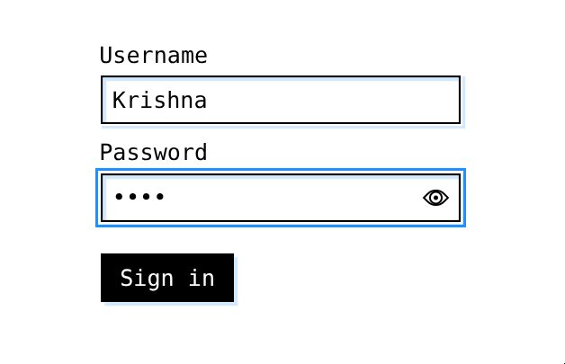
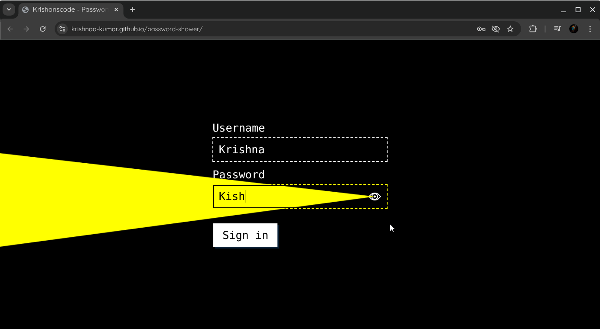

# 🔐 Password Shower

A simple and responsive web tool to **toggle password visibility** using HTML, CSS, and JavaScript. Ideal for learning or integrating into login/signup forms.

🚀 [Live Demo](https://krishnaa-kumar.github.io/password-shower/)

---

## 📸 Preview

---

## 🛠️ Features

- Show/Hide password functionality
- Eye icon toggle interaction
- Mobile-friendly and minimal design
- Built with pure HTML, CSS, and JavaScript (no frameworks)
